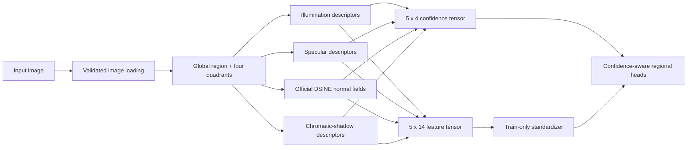
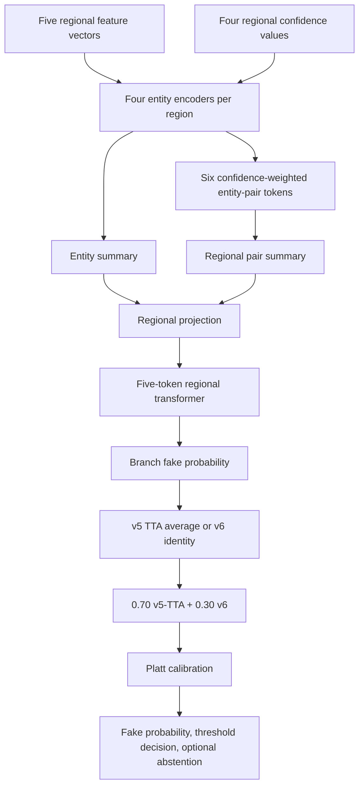
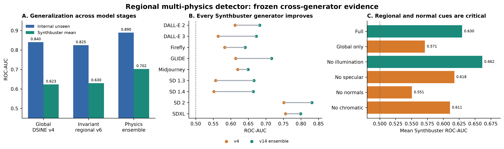
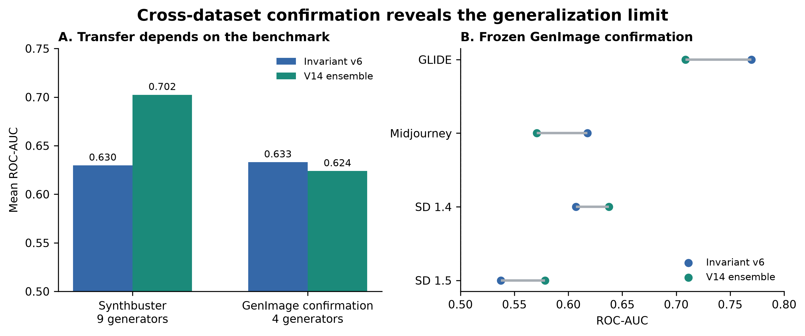

# Full Technical Report: Physics Ensemble v14

**Project:** Physics-inspired AI-image detection thesis project  
**Released artifact:** `models/physics_ensemble_v14/model.pt`  
**Status:** frozen research artifact; strongest current model on the project’s nine-generator Synthbuster evaluation  
**Report date:** 2026-09-17

## Executive summary

Physics Ensemble v14 is a compact, calibrated ensemble for distinguishing authentic from AI-generated images using four **physics-inspired image descriptors** rather than a pretrained deepfake classifier or semantic foundation-model embedding. It analyzes illumination consistency, scene-wide specular appearance, DSINE surface-normal consistency, and chromatic-shadow consistency in one global image region plus four aligned quadrants.

The final model is a development-selected blend of two branches:

- 70% regional multi-physics v5 with spatial test-time averaging;
- 30% generator-invariant regional v6.

It achieved **80.31% internal-unseen accuracy and 0.8895 ROC-AUC**, then **63.51% mean accuracy and 0.7024 mean ROC-AUC** across nine frozen Synthbuster generators. This was a statistically supported improvement over the project’s earlier global DSINE model on that benchmark.

A later disjoint GenImage confirmation measured **0.6239 mean ROC-AUC**, below the frozen v6 branch’s 0.6330. Therefore v14 is the strongest model in this project for the primary Synthbuster transfer benchmark, but it is **not** a universal detector, a forensic tool, a state-of-the-art claim, or a breakthrough claim.

## 1. Research objective

The project began with the hypothesis that generators can leave inconsistencies in image cues that normally cohere under a common imaging and scene-formation process. The goal was to test whether compact descriptors of those cues could transfer to image generators absent from training.

The detector does not claim that any single descriptor proves a physical law was violated. The learned classifier uses feature patterns and agreements between descriptors. The contribution is therefore an **interpretable, physics-inspired, regional consistency detector**, evaluated with generator-held-out and cross-dataset tests.

## 2. Development history and improvements

| Stage | Main change | Internal unseen result | External finding and decision |
|---|---|---:|---|
| Historical 40k baseline | Compact global feature classifier over the original cache | 71.79% accuracy, 0.7880 AUC | Useful starting point, but cache provenance and raw-image reproducibility were insufficient for a thesis claim. |
| v3 multi-entity | Four entities and confidence-aware fusion over the audited historical cache | 73.23% accuracy, 0.8135 AUC | Entity ablations indicated that a multi-entity formulation had signal, but a raw-image rebuild was required. |
| v4 DSINE global | Rebuilt features with the official pretrained DSINE normal estimator and full-image descriptors | 75.86% accuracy, 0.8404 AUC | 0.6232 mean Synthbuster AUC. Established a reproducible external-transfer baseline. |
| v5 regional | One global region plus four quadrants; regional transformer and pairwise entity interactions | 81.02% accuracy, 0.8920 AUC | Regional reasoning substantially improved internal discrimination. |
| v6 generator-invariant | Added GenImage ADM, BigGAN, and VQDM training domains plus gradient-reversal domain adversary; held Wukong out for development | 74.54% accuracy, 0.8249 AUC | 0.6297 mean Synthbuster AUC. Lower internal score but designed to resist generator-specific representations. |
| v7/v9/v11 ensemble search | Development-only mixture of v5, v6, and additional variants | 80.54% accuracy, 0.8892 AUC | Wukong selected approximately 70% v5 and 30% v6; extra branches received zero weight. |
| v8/v10/v12 negative results | Learned attention, illumination-disabled training, and fixed entity masks | Lower Wukong selection scores | Kept as ablations; not promoted. |
| v13 spatial TTA | Tested horizontal and vertical quadrant permutations on development data only | v5 Wukong AUC increased from 0.6485 to 0.6489 | Applied only to the v5 branch; v6 kept the identity arrangement. |
| **v14 final** | Recalibrated frozen 70/30 v5-TTA/v6 mixture | **80.31% accuracy, 0.8895 AUC** | **0.7024 mean Synthbuster AUC**, the project’s highest externally validated result. |

The history shows why v14 is an ensemble. The regional v5 branch is the strongest in-domain and captures local contradictions. The v6 branch was trained to make generator identity less recoverable and complements v5 on the held-out Wukong development generator. The ensemble weight was selected before opening Synthbuster or confirmation labels.

## 3. Input data and split discipline

### 3.1 Data roles

| Data source | Role | Allowed use |
|---|---|---|
| DiffusionDB fake and COCO real images | Primary source domain | Train feature standardization and classifier fitting |
| Group-disjoint internal development split | Development | Architecture comparison and early stopping |
| Group-disjoint internal calibration split | Calibration | Platt calibration, threshold, abstention band |
| Group-disjoint internal unseen split | Internal test | Reported only after selection |
| GenImage ADM, BigGAN, VQDM | Additional source domains | Train v6 and its domain adversary |
| GenImage Wukong | Held-out generator development set | Ensemble and TTA selection only; no gradient updates |
| Synthbuster fake sets plus RAISE real pairs | Frozen external test | One post-selection nine-generator evaluation |
| Disjoint GenImage GLIDE, Midjourney, SD v1.4, SD v1.5 | Confirmatory test | Post-freeze evaluation only |

### 3.2 Leakage controls

- Every rebuilt feature cache stores labels, source manifests, image hashes, descriptor schema, and DSINE provenance.
- Group-disjoint splitting uses 64-bit difference-hash groups, so visually near-identical images are not split between fitting, development, calibration, and internal test partitions.
- The confirmatory set came from GenImage archive positions 4,001–6,000, outside the earlier development sample.
- Two conservative perceptual-hash matches with protected data were excluded from the confirmation despite distinct SHA-256 file hashes.
- Synthbuster and confirmation labels were not read by the selection scripts.

## 4. Feature pipeline: image to regional physics tensor

Each image becomes five spatial tokens: `global`, `top_left`, `top_right`, `bottom_left`, and `bottom_right`. Every token has 14 descriptor values and four confidence values. The final feature tensor is therefore `[5 regions, 14 features]`, with aligned confidence tensor `[5 regions, 4 entities]`.

| Entity | Dimensions | What is measured | Confidence role |
|---|---:|---|---|
| Illumination consistency | 5 | Intensity-gradient and low-order illumination consistency proxies | Reduces influence when illumination evidence is weak or unstable |
| Specular optics | 4 | Scene-wide high-frequency highlight distribution and consistency | Reduces influence when reliable highlight evidence is absent |
| Surface normals | 3 | Regional residual statistics from official uncertainty-aware DSINE normal and concentration fields | Represents observability of the normal estimate |
| Chromatic shadows | 2 | Bright/dark chromatic relationship consistency | Reduces influence when color-shadow evidence is weak |

DSINE is a verified pretrained component used only for normal estimation. The final deepfake detector itself is trained on the project’s compact features. DSINE’s exact checkpoint and preprocessing provenance are recorded with cache artifacts; it is not described as a pretrained deepfake detector.

The global token retains overall scene context. Quadrants expose local disagreement, such as a lighting or normal pattern that looks plausible locally but conflicts with another part of the image.

## 5. Branch architecture and v14 inference

Each v5/v6 branch uses the same compact regional architecture:

1. Separate multilayer encoders process each entity plus its confidence.
2. Low-confidence entities are replaced by learned missing-cue tokens rather than treated as zero-valued evidence.
3. Six pair tokens represent all entity pairs within each spatial region.
4. Confidence-aware attention aggregates pair tokens within a region.
5. A transformer compares the five regional summaries.
6. A classifier outputs a fake-image logit.
7. Stored train-only means and standard deviations standardize the 14 descriptor columns before inference.

### 5.1 The frozen v14 ensemble manifest

`models/physics_ensemble_v14/model.pt` is a lightweight manifest that verifies SHA-256 hashes before loading its branches:

| Branch | File | Weight | Spatial inference |
|---|---|---:|---|
| `regional_v5_tta` | `models/region_tta_v13/regional_v5_tta/model.pt` | 0.70 | Identity, horizontal, vertical, and 180° quadrant permutations averaged |
| `generator_invariant_v6_tta` | `models/region_tta_v13/generator_invariant_v6_tta/model.pt` | 0.30 | Identity permutation selected |
| `physics_masked_v10` | `models/physics_masked_v10/model.pt` | 0.00 | Included for auditability; not used in the final score |

The raw branch probabilities are mixed, transformed to logits, passed through a stored Platt calibration mapping, then thresholded. The probability label is **fake**.

### 5.2 Calibration and abstention

The final policy was fit on 4,572 calibration observations only:

- Platt parameters: `a = 1.2098870129`, `b = 0.1952424480`;
- binary decision threshold: `0.5589603971`;
- abstention interval: `(0.4589603971, 0.6589603971)`;
- calibration accuracy: 80.45%.

ROC-AUC is the primary transfer measure because it does not depend on that threshold. Thresholded accuracy is reported as a secondary metric and should not be compared across different class ratios or deployment settings without recalibration.

## 6. How v14 was selected

Selection followed a fixed priority rule before final external evaluation:

1. Train branch models on their permitted source domains.
2. Evaluate candidates on group-disjoint internal development and held-out GenImage Wukong.
3. Rank candidates by the lower of their two AUCs; break ties with their mean AUC.
4. Fit calibration only after weights and TTA mode were selected.
5. Freeze artifacts and hashes.
6. Evaluate Synthbuster once, then run the separate GenImage confirmation.

The selected v14 mixture achieved 0.8832 internal-development AUC and 0.6516 Wukong-development AUC. It beat the pre-TTA mixture’s Wukong score by a small margin while retaining a comparable internal score. No Synthbuster or confirmatory label determined the ensemble weight, calibration, threshold, or TTA choice.

## 7. Final performance

### 7.1 Internal unseen test

| Samples | Accuracy | ROC-AUC | EER | Real recall | Fake recall |
|---:|---:|---:|---:|---:|---:|
| 7,992 | 80.31% | 0.8895 | 19.16% | 82.90% | 77.71% |

The internal test is deliberately challenging because difference-hash groups are excluded from fitting, development, and calibration. It still belongs to the project’s source-distribution family, so it does not measure full cross-generator transfer by itself.

### 7.2 Frozen Synthbuster evaluation

The frozen external result contains 1,000 paired real/fake examples for each of nine generators, for 18,000 total observations.

| Generator | Accuracy | ROC-AUC | EER |
|---|---:|---:|---:|
| DALL·E 2 | 62.15% | 0.6825 | 36.80% |
| DALL·E 3 | 61.80% | 0.6725 | 36.70% |
| Firefly | 56.90% | 0.6410 | 39.10% |
| GLIDE | 64.50% | 0.7163 | 34.60% |
| Midjourney v5 | 58.80% | 0.6492 | 38.55% |
| Stable Diffusion 1.3 | 59.10% | 0.6659 | 37.60% |
| Stable Diffusion 1.4 | 59.90% | 0.6639 | 37.80% |
| Stable Diffusion 2 | 75.85% | 0.8310 | 23.95% |
| Stable Diffusion XL | 72.60% | 0.7990 | 26.85% |
| **Equal-generator mean** | **63.51%** | **0.7024** | **34.66%** |

The mean reaches the predeclared 0.70 Synthbuster AUC target, but Firefly’s 0.6410 AUC is below the required minimum of 0.65. The breakthrough gate was therefore not passed.

### 7.3 Disjoint GenImage confirmation

The confirmation retained 7,998 observations after overlap exclusions.

| Frozen model | GLIDE | Midjourney | SD v1.4 | SD v1.5 | Mean AUC | Mean accuracy |
|---|---:|---:|---:|---:|---:|---:|
| v14 ensemble | 0.7085 | 0.5709 | 0.6376 | 0.5785 | 0.6239 | 58.28% |
| v6 branch diagnostic | 0.7698 | 0.6177 | 0.6070 | 0.5376 | 0.6330 | 59.57% |

V14 minus v6 was -0.0091 mean AUC, with a paired 5,000-repeat bootstrap 95% interval of `[-0.0169, -0.0016]`. V6 was retained as a diagnostic comparison and was not substituted after the confirmation was observed. This protects the original freeze but demonstrates that the selected v14 mixture does not transfer uniformly across datasets.

## 8. Evidence that the improvements were meaningful

On Synthbuster, the earlier DSINE global v4 achieved 0.6232 mean AUC and 58.44% mean accuracy. V14 reached 0.7024 and 63.51%, respectively. The pre-TTA v7 mixture, which has the same 70/30 branch composition, was compared with paired, class-stratified resampling within each generator:

| Comparison on Synthbuster | Mean AUC change | 95% bootstrap interval | Mean accuracy change | 95% bootstrap interval |
|---|---:|---:|---:|---:|
| v7 mixture vs v4 DSINE global | +0.0783 | [+0.0720, +0.0843] | +5.56 percentage points | [+4.89, +6.24] |
| v7 mixture vs v6 | +0.0718 | [+0.0674, +0.0762] | +5.45 percentage points | [+4.86, +6.05] |
| v14 vs regional v5 on confirmation | +0.0151 | [+0.0123, +0.0179] | +0.80 percentage points | [+0.26, +1.34] |
| v14 vs v6 on confirmation | -0.0091 | [-0.0169, -0.0016] | -1.28 percentage points | [-2.26, -0.29] |

The first two intervals establish a robust improvement on Synthbuster for the v7/v14 family relative to the project’s earlier models. The final row is equally important: it shows the cross-dataset limitation rather than hiding it.

## 8.1 Publication figures

The release includes two figures generated from the frozen JSON reports:

PDF versions are included in the same folder for use in the thesis manuscript.

## 9. Physics and spatial ablations

A frozen v6 Synthbuster ablation tested the contribution of each entity and spatial reasoning. Mean AUC values were:

| Input variant | Mean AUC | Change from full v6 |
|---|---:|---:|
| Full regional physics | 0.6297 | — |
| Global region only | 0.5710 | -0.0587 |
| Without illumination | 0.6615 | +0.0318 |
| Without specular optics | 0.6175 | -0.0122 |
| Without DSINE surface normals | 0.5506 | -0.0791 |
| Without chromatic shadows | 0.6106 | -0.0190 |

Interpretation:

- Regional comparison is important: removing quadrants reduced mean AUC by 0.0587.
- DSINE surface-normal evidence is the strongest individual contributor in this external ablation.
- Specular and chromatic-shadow evidence add complementary information.
- Illumination can be dataset-sensitive. Removing it improved this one external v6 ablation, but an illumination-disabled retraining variant did not improve Wukong development selection and was assigned zero final ensemble weight.

This distinction matters. A post-freeze external ablation describes where a model succeeds or fails; it is not a license to retune the released model on test labels.

## 10. Reproducibility and release contents

The GitHub release includes:

- `models/physics_ensemble_v14/model.pt`: v14 ensemble manifest;
- `models/region_tta_v13/*/model.pt`: the two weighted branch checkpoints;
- `models/physics_masked_v10/model.pt`: the audited zero-weight branch;
- `models/physics_ensemble_v14/selection.json` and `policy.json`: selection and calibration record;
- `models/physics_ensemble_v14/evaluation_internal.json`: internal unseen metrics;
- `models/physics_ensemble_v14/external_synthbuster/evaluation.json`: nine-generator external metrics;
- `models/physics_ensemble_v14/genimage_confirmatory/evaluation.json`: disjoint confirmation and paired bootstrap results;
- `scripts/evaluate_physics_ensemble_v7.py`: hash-checking evaluation entry point;
- `models/physics_ensemble_v14/REPRODUCE.md`: environment and rerun instructions.

Before release, the model manifest’s three branch SHA-256 values were verified and one cached inference was executed successfully. The release does not redistribute raw datasets or feature caches. Rebuilding features requires the licensed input images and the documented DSINE dependency/provenance.

## 11. Appropriate thesis claims and limitations

### Supported claim

> Regional multi-physics reasoning, DSINE normal estimation, and development-selected generator-invariant fusion improved this project’s global physics baseline across nine frozen Synthbuster generators, reaching 0.7024 mean ROC-AUC, while a disjoint GenImage confirmation measured a material cross-dataset generalization limit.

### Not supported

- A universal detector claim.
- A claim of state-of-the-art performance against published methods without matched public baselines.
- A forensic, legal, moderation, or autonomous-decision use claim.
- A statement that any individual feature proves a physical-law violation.

The limitation is scientifically useful. It identifies that generator and dataset shifts can alter the statistical relationship between the compact physical descriptors and the class label. A follow-up model must be selected using a broader multi-generator development protocol and then evaluated on an untouched final benchmark; it must not be tuned against these frozen external results.

## 12. Conclusion

V14 is the project’s strongest released model because it combines the regional branch’s discriminative power with the v6 branch’s generator-invariance objective, preserves strict group-disjoint selection and calibration, and achieved the best frozen Synthbuster result: 0.7024 mean AUC over nine unseen-generator sets.

Its external confirmation result is lower, 0.6239 mean AUC, so the thesis should present v14 as a rigorously evaluated regional multi-physics baseline with a documented transfer boundary. The complete artifact, prediction files, calibration policy, evaluation scripts, and branch hash checks make this conclusion inspectable and reproducible.

