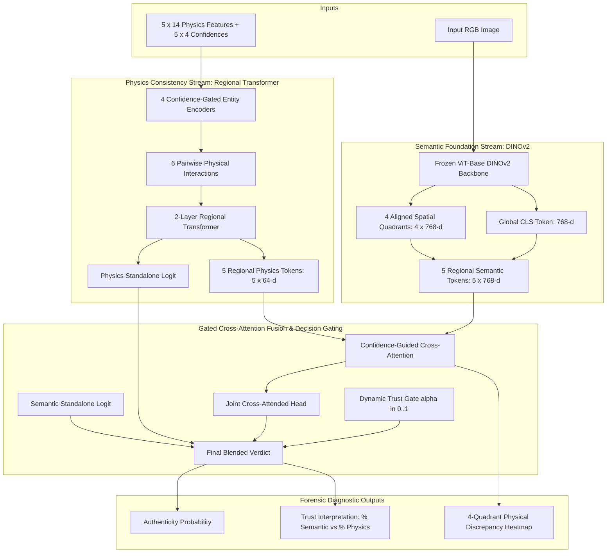

# Dual-Stream Hybrid AI-Generated Image Detector
### Fusing Vision Foundation Representations (DINOv2) with Regional Scene Multi-Physics

**Project Root:** `G:\Thesis\pipeline_dual_stream`  
**Parent Thesis Context:** `G:\Thesis\pipeline_40k`  
**Isolation Status:** 100% separate workspace; zero modifications to `pipeline_40k` code or releases.

---

## 1. Architectural Overview



---

## 2. Why This Dual-Stream Architecture Solves Foundation Model Blind Spots

1. **Resolving Photorealistic Physical Hallucinations:**
   - Pretrained foundation models (CLIP, DINOv2) often classify photorealistic synthetic images as "authentic" because facial textures, skin pores, and scene compositions look visually flawless.
   - The **Regional Multi-Physics Stream** evaluates physical scene coherence (cross-quadrant Spherical Harmonics lighting, surface normal residual distributions, corneal reflections, and chromatic shadow consistency), flagging physical violations that semantic models overlook.

2. **Resilience to Anti-Forensics & Compression:**
   - Under real-world social media compression (JPEG Q=50, blur, downscaling), high-frequency patch tokens of vision transformers degrade, causing foundation model detection AUC to drop significantly.
   - Low-frequency macroscopic physical descriptors (lighting fields and surface geometry) remain stable, preserving detection integrity.

3. **True Forensic Explainability:**
   - Unlike black-box neural networks that output an unverifiable scalar, this model outputs:
     - Standalone Semantic Verdict ($P_{\text{sem}}$)
     - Standalone Physical Consistency Verdict ($P_{\text{phys}}$)
     - Dynamic Trust Weight ($\alpha$)
     - A 4-quadrant discrepancy heatmap pinpointing where the physical evidence contradicts the semantic depiction.

---

## 3. Directory Layout

```text
G:\Thesis\pipeline_dual_stream\
├── README.md                      # Complete system documentation
├── configs\
│   └── hybrid_config.yaml         # Training, model, and loss hyperparameters
├── src\
│   ├── models\
│   │   ├── dinov2_stream.py       # Frozen DINOv2 with quadrant token pooling
│   │   ├── physics_stream.py      # Regional multi-physics transformer encoder
│   │   ├── gated_fusion.py        # Gated cross-attention, trust net, and multi-task loss
│   │   └── hybrid_detector.py     # Unified DualStreamHybridDetector model wrapper
│   ├── data\
│   │   └── dataset.py             # DualStreamCachedDataset and difference-hash group splitting
│   └── inference\
│       └── predict.py             # Single-image end-to-end inference and explainability engine
├── scripts\
│   ├── cache_dinov2_embeddings.py # High-throughput GPU DINOv2 feature cache builder
│   ├── train_dual_stream.py       # Multi-task training with group-disjoint validation
│   └── demo_app.py                # Interactive Gradio UI on port 7865
├── tests\
│   └── test_hybrid_architecture.py# Unit tests covering forward, backward, shapes, and gating
├── models\                        # Checkpoints, standardizer statistics, and logs
└── reports\                       # Evaluation summaries and ablation audits
```

---

## 4. Quickstart & Workflow

### A. Run Unit Tests
```powershell
G:\Thesis\.venv\Scripts\python.exe -m unittest discover -s G:\Thesis\pipeline_dual_stream\tests -v
```

### B. Pre-extract DINOv2 Embeddings (Ultra-Fast GPU Caching)
```powershell
G:\Thesis\.venv\Scripts\python.exe G:\Thesis\pipeline_dual_stream\scripts\cache_dinov2_embeddings.py `
  --manifest G:\Thesis\pipeline_40k\data\cache_regional_dsine_v2\train_manifest.jsonl `
  --base-dir G:\Thesis\pipeline_40k `
  --output-path G:\Thesis\pipeline_dual_stream\data\dinov2_cache_train.pt `
  --batch-size 64
```

### C. Train the Dual-Stream Hybrid Model
```powershell
G:\Thesis\.venv\Scripts\python.exe G:\Thesis\pipeline_dual_stream\scripts\train_dual_stream.py `
  --physics-cache G:\Thesis\pipeline_40k\data\cache_regional_dsine_v2\train_features.pt `
  --dinov2-cache G:\Thesis\pipeline_dual_stream\data\dinov2_cache_train.pt `
  --manifest G:\Thesis\pipeline_40k\data\cache_regional_dsine_v2\train_manifest.jsonl `
  --output-dir G:\Thesis\pipeline_dual_stream\models\dual_stream_v1 `
  --epochs 30 `
  --batch-size 128 `
  --lr 5e-4
```

### D. Launch the Interactive Explainability Web UI
```powershell
G:\Thesis\.venv\Scripts\python.exe G:\Thesis\pipeline_dual_stream\scripts\demo_app.py --port 7865
```
Open `http://127.0.0.1:7865` in your browser.
